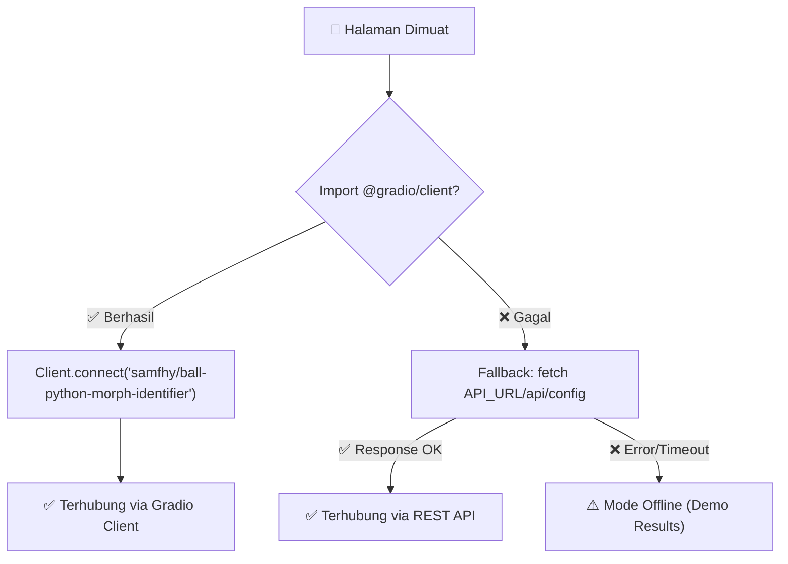
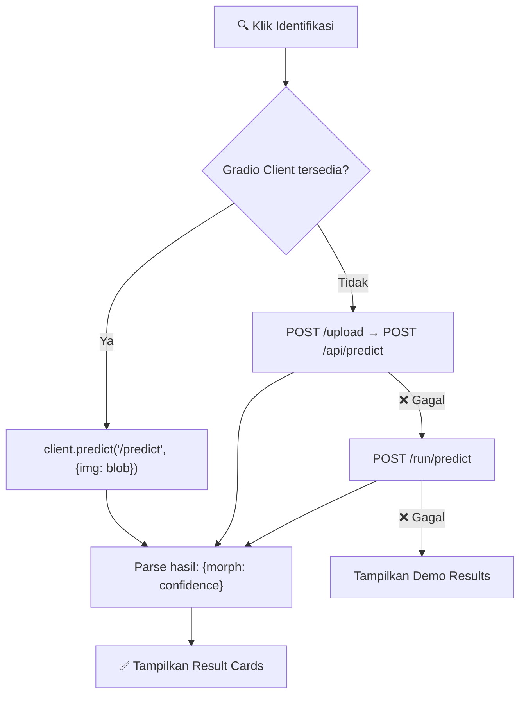

# 🐍 Ball Python Morph Identifier — API & Docker Guide

## 🔌 Cara Kerja API HuggingFace

Aplikasi ini terhubung ke model AI di **HuggingFace Space**: [`samfhy/ball-python-morph-identifier`](https://huggingface.co/spaces/samfhy/ball-python-morph-identifier)

### Strategi Koneksi (Multi-Fallback)

Saat halaman dimuat, `app.js` akan otomatis mencoba koneksi dengan urutan berikut:



### Saat User Klik "Identifikasi Morph"



### Status Indikator di Navbar

| Status | Warna | Arti |
|--------|-------|------|
| 🟡 Connecting... | Kuning | Sedang menghubungkan ke HF Space |
| 🟢 AI Model Active | Hijau | Terhubung, siap digunakan |
| 🔴 Offline (Demo) | Merah | Tidak bisa konek, pakai data demo |

> [!NOTE]
> Tidak perlu API key! HuggingFace Space `samfhy/ball-python-morph-identifier` bersifat **public** dan bisa diakses langsung.

---

## 🐳 Menjalankan di Docker Container

### Prasyarat
- Docker Desktop terinstall dan running

### Cara 1: Docker Compose (Recommended)

```bash
# Build & run
docker compose up -d

# Buka di browser
# http://localhost:8080
```

Selesai! Aplikasi akan berjalan di **port 8080**.

### Cara 2: Docker Build Manual

```bash
# Build image
docker build -t bp-morph-identifier .

# Run container
docker run -d --name bp-morph -p 8080:80 bp-morph-identifier

# Buka di browser
# http://localhost:8080
```

### Cara 3: Custom Port

```bash
# Ganti 3000 dengan port yang diinginkan
docker run -d --name bp-morph -p 3000:80 bp-morph-identifier
```

### Docker Commands Berguna

```bash
# Lihat status container
docker ps

# Lihat logs
docker logs bp-morph-identifier

# Stop container
docker compose down

# Rebuild setelah edit kode
docker compose up -d --build

# Health check
curl http://localhost:8080/health
```

---

## 📁 Struktur File Lengkap

```
BP-Morph-Identifier/
├── index.html           ← Halaman utama
├── style.css            ← Styling premium dark UI
├── app.js               ← Logic + API HuggingFace
├── Dockerfile           ← Container image (Nginx Alpine)
├── docker-compose.yml   ← Orchestration (port 8080)
├── nginx.conf           ← Nginx config (gzip, cache, CORS)
└── .dockerignore        ← File yang di-skip saat build
```

> [!TIP]
> Untuk development tanpa Docker, cukup buka `index.html` langsung di browser atau jalankan `npx serve` di folder project.

---

## ❓ Troubleshooting

| Masalah | Solusi |
|---------|--------|
| Status "Offline (Demo)" | HF Space mungkin sedang sleep. Buka [space langsung](https://huggingface.co/spaces/samfhy/ball-python-morph-identifier) dulu untuk wake up |
| CORS error di console | Gunakan Docker/Nginx, jangan buka file:// langsung |
| Docker build error | Pastikan Docker Desktop running |
| Port 8080 sudah dipakai | Ganti port di `docker-compose.yml`: `"9090:80"` |
